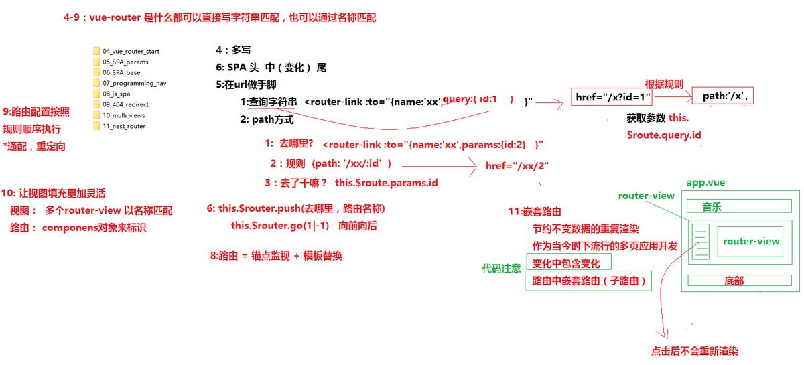

# Vue

## Vue基础

```Javascript
script src="./node_modules/vue/dist/vue.js"></script>
window.onload = function () {
            let vm = new Vue({
                el:'#app',
                data:{
                   msg:'99',
                   alt:'v-bind"绑定"'
                }
            })
        }
```
```html
<div id="app">

        <h1>你好</h1>
        <h1>{{msg}}</h1>
         <p :title="alt">999999</p>
</div>
```
 1. {{}} 我是Vue表达式只能在标签内容中使用
 2. 元素的属性 
    v-bind绑定可以简写成:title="alt"
 3. 事件v-on:click="XXX"或者@click="XXX"
 4. Vue内部的东西 
   - data:{数据}
   - methods:{方法}
 5. Vue表达式{{}}在标签里输出东西
   - vue指令
     - v-bind  单向给属性
     - v-on    事件- 配合 methods
     - v-model 双向给value
     - v-html  输出带有html标签样式的东西
     - v-show  控制显示与隐藏、相当于display
     - v-if    控制删除、插入节点
     - v-cloak ..
     - v-once  仅渲染一次
     - v-pre   用来禁用标签里面的表达式{{}}
 6. 数据绑定:
    - 双向绑定:数据与视图之间--任何一方变了，另一方也会跟着改变
    - 单向绑定:数据与视图之间--任何一方变了，另一方不会改变
 

 data --普通属性
 methos --普通方法
 计算属性 --简单、可缓存  受控制访问-get/set
 监听 --当变化时有通知 -适合异步操作 
## Vue-Router
#### 命名路由
* 需求，通过a标签点击，做页面数据的跳转
* 使用router-link标签
    - 1:去哪里 `<router-link to="/beijing">去北京</router-link>`
    - 2:去哪里 `<router-link :to="{name:'bj'}">去北京</router-link>`
        + 更利于维护，如果修改了path，只修改路由配置中的path，该a标签会根据修改后的值生成href属性
#### 编程导航
* 不能保证用户一定会点击某些按钮
* 并且当前操作，除了路由跳转以外，还有一些别的附加操作
* this.$router.go 根据浏览器记录 前进1 后退-1
* this.$router.push(直接跳转到某个页面显示)
    - push参数: 字符串 /xxx
    - 对象 :  `{name:'xxx',query:{id:1},params:{name:2}  }`
    
#### 用法
   - 渲染容器  <router-view></router-view> router的component会被渲染到里面
     - to="/路径"
     - :to="{ name,path,params,query}"
   - 路由跳转 <router-link >文字</router-link>
   - js操作路由 
     - `this.$router.go(-1)` 
     - `this.$router.push('/user')` 
   - 路由参数 
     - 声明path的时候   { path: '/user/:id', component: { template: '<div>{{$route.params.id}}</div>'}},
     - $route.params.id
   - 监听跳转
     - watch方法 ``` watch: {'$route.params.id'(newVal, odlVal) {alert(`${odlVal}---> ${newVal}`)}```不推荐
     - `beforeRouteUpdate (to, from, next) { }`
   
 #### 总结 ： 路由就是一个锚点（#XX）,根据锚点信息，确定要显示那个组件
 
 #### 对象
   1. path       匹配路由路径 可以带参数
   2. component  路由主体
   3. children   子路由
    - 路径'page'
 ## 组件
#### 全局组件
  - 注册: `Vue.component('名字',{template:'xxx'})`
  - 使用: `<名字></名字>`
 #### 局部组件
  - 在Vue实例上`components:{ '名字':{template:'xxx'} }`
 ### 组件通信
 


  #### 父组件传给子组件
  ::: tip 也可以传输数组或者对象
  :::
  * 父组件通过子组件的属性将值进行传递
    - 方式有2：
       + 常量 prop1 = "常亮值"
       + 常量 :prop2 = "变量名"
  * 子组件需要声明
    - 根据props:['prop1,prop2']
    - 在页面直接使用{{ prop1 }}
    - 在js中应该如何使用prop1？   用this.prop1获取
  * 地方

  - 父组件
   ```html
<template>
  <div class="hello">
    <p>我是父组件</p>
    <Son :price="index"></Son>
    <input type="text" v-model="index" />
    <router-view></router-view>
  </div>
</template>
<script>
import Son from "@/components/commit/son";
export default {
  name: "HelloWorld",
  data() {
    return {
      index: "我是父组件的值我传给子组件"
    };
  },
  components: {
    Son
  }
};
</script>
```

  - 子组件
```html
<template>
  <div class="son">
    <p>{{ msg }}</p>
    <p>{{ price }}</p>
  </div>
</template>
<script>
export default {
  data() {
    return {
      msg: "我是子组件"
    };
  },
  props: ["price"]
};
</script>
```
 ### 组件的refs
   * 救命稻草, 前端框架就是为了减少DOM操作，但是特定情况下，也给你留了后门
  * 在指定的元素上，添加ref="名称A"
  * 在获取的地方加入 this.$refs.名称A  
    - 如果ref放在了原生DOM元素上，获取的数据就是原生DOM对象
        + 可以直接操作
    - 如果ref放在了组件对象上，获取的就是组件对象
        + 1:获取到DOM对象,通过this.$refs.名称B.$el,进行操作
    - 对应的事件
        + created 完成了数据的初始化，此时还未生成DOM，无法操作DOM
        + mounted 将数据已经装载到了DOM之上,可以操作DOM
 ### 组件的事件
  - $on
  - $emit
   
## Vue-cli
  1. 开发环境
  2. 检测代码质量
  3. 打包、编译
  4. 测试
  ### 安装 
  1. `cnpm i  -g vue-cli`
  2. 列出模板列表 `vue list`
  3. 创建工程 `vue init webpack 项目名称`
  ### 包含组件
  1. 编译：
    - `postcss、autoprefixer`	编译CSS
    -` babel	`		编译ES6
    - `webpack`		编译
2. 测试：
   - `*-loader`		热编译
   - `eslint`		代码质量
   - `jest`			单元测试
   - `neightwatch	`	e2e测试
3. 其他
   - `chalk	`		命令行高亮
### 工程目录
 - 文件
   - `babelrc `           babel配置
   - `editorconfig`       编辑器配置
   - `eslintignore`       eslint忽略列表
   - `eslintrc.js`        eslint配置
   - `gitignore  `        git忽略列表
   - `postcssrc.js`       postcss配置
   - `package.json`        node配置
   - `README.md  `         说明
   - `index.html`          入口文件
- 文件夹
  - `config/`             配置文件
  - `src/   `             源文件(打包)
  - `static/`             静态资源
  - `test/  `             测试配置、用例
  - `build/ `             生成用的配置
### 可用脚本package.json
 - `dev/start `          运行项目(开发模式)
 - `test      `          测试
 - `unit      `        单元测试
 - `e2e       `        端到端测试
 - `lint      `          代码质量测试
 - `build     `          生成项目
## Vuex   
## Webpack
  ####优化webpack打包：
  - app.XXX.js  
     - 打包在一起`import xxx from xxx  -> components{xxx}`
     - 按需加载` components{xxx:import from xxx}`
## 背景图片路径拼接

template代码
```html
<a class="new_onLine_one" v-for="(brand,index) in imgList " :key="index">
     <div class="fl rank_img" v-bind:style="{ 'background-image': 'url(' + brand.src+ ')' }">
     </div>
</a>
```
js代码
```javascript

export default {
    name: "Carousel",
    data() {
     return{
         imgList : [
            {id: 1, src:'https://placehold.it/190x180'},
            {id: 2, src:'https://placehold.it/180x190'},
          ]
     }
    },
};
```